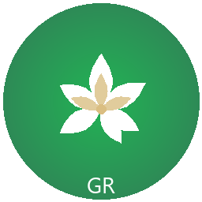

<p align="center">
  
</p>

<h1 align="center">GreenRhythm</h1>

<p align="center">
  <b>Fast, modern proxy client powered by sing-box 1.13</b>
</p>

<p align="center">
  <a href="https://github.com/tarik1377/nekoray/releases/latest">
    
  </a>
  <a href="https://github.com/tarik1377/nekoray/releases">
    
  </a>
  <a href="https://github.com/tarik1377/nekoray/actions">
    
  </a>
</p>

---

## What is GreenRhythm?

A cross-platform proxy client with Qt GUI, built on **sing-box 1.13.5** core. Designed for speed, privacy, and ease of use.

### Key Features

- **sing-box 1.13.5** — latest stable core with VLESS+Reality performance
- **Smart routing** — RU sites direct, everything else through proxy
- **TUN mode** — system-wide VPN with one click
- **Auto config** — optimized defaults out of the box
- **Ad blocking** — built-in geosite ad filter
- **DNS splitting** — Yandex DNS for RU, Cloudflare for international

### Supported Protocols

| Protocol | Status |
|----------|--------|
| VLESS + Reality + XTLS-Vision | Recommended |
| VMess | Supported |
| Trojan | Supported |
| Shadowsocks | Supported |
| SOCKS 4/5, HTTP(S) | Supported |
| Hysteria2, TUIC | Supported |
| WireGuard | Supported |
| Custom configs | Supported |

---

## Quick Start

### 1. Download

Download the latest release from [**Releases**](https://github.com/tarik1377/nekoray/releases/latest).

### 2. Unzip & Run

Extract the archive. Run `nekobox.exe` **as Administrator** (required for TUN mode).

### 3. Add Profile

- Click **Server** → **New profile** → **VLESS**
- Enter your server details
- Double-click the profile to connect

### 4. Enable TUN

Go to **Settings** → **TUN Mode** → Enable. All system traffic will be routed automatically.

---

## Default Configuration

GreenRhythm comes pre-configured for optimal use:

```
Direct (no proxy):     .ru .su .рф + VK, Yandex, Mail.ru, Avito, Ozon, WB, Sber...
                       + Microsoft, Windows Update, Office, Bing
Via proxy:             Everything else (YouTube, GitHub, Discord, Claude, etc.)
DNS:                   Cloudflare (international) + Yandex (RU)
Process routing:       Discord, Telegram, Claude → always proxy
Ad blocking:           geosite:category-ads-all
```

---

## Build from Source

### Requirements

- Qt 6.7+ (MSVC 2022)
- Go 1.24+
- CMake + Ninja
- MSVC 2022

### Build

```bash
# Build Go core
cd go/cmd/nekobox_core
go build -tags "with_clash_api,with_gvisor,with_quic,with_wireguard,with_utls"

# Build Qt GUI
mkdir build && cd build
cmake -GNinja -DQT_VERSION_MAJOR=6 -DCMAKE_BUILD_TYPE=Release ..
ninja
```

---

## Credits

Built on the shoulders of giants:

- [SagerNet/sing-box](https://github.com/SagerNet/sing-box) — core engine
- [MatsuriDayo/nekoray](https://github.com/MatsuriDayo/nekoray) — original project (archived)
- [Qt](https://www.qt.io/) — GUI framework

---

<p align="center">
  <sub>GreenRhythm is licensed under GPL-3.0</sub>
</p>
